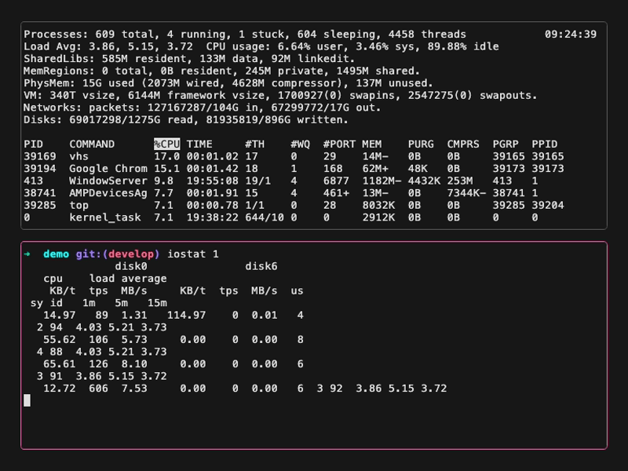

# Bubbleterm - TUI terminal component for Go #

[](https://raw.githubusercontent.com/grafviktor/bubbleterm/develop/LICENSE)

## 1. Description ##

A re-usable terminal component that can be embedded into a TUI application. This demo represents routing PTY I/O into x/vt emulators, rendering with [bubbletea](https://github.com/charmbracelet/bubbletea) library.



## 2. Installation and usage ##

```bash
go get github.com/grafviktor/bubbleterm@v0.1.0
```

```go
import "github.com/grafviktor/bubbleterm"

...
term, err := bubbleterm.New(
    bubbleterm.WithCommand("/bin/bash"),
    bubbleterm.WithInitialWidth(80),
    bubbleterm.WithInitialHeight(24),
)
```

Also see [examples/terminal-simple](examples/terminal-simple) and [examples/terminal-multiplexer](examples/terminal-multiplexer) for the examples.

## 3. License ##

MIT - see [LICENSE](LICENSE).
